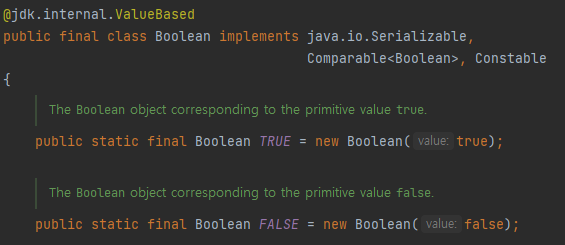

## 이펙티브 자바 - 1.정적 팩터리 메서드는 클래스에 정적 메서드를 정의하여, 생성자 대신 객체를 생성할 수 있게 만드는 기법이다

## 이펙티브 자바 - 1.정적 팩터리 메서드는 클래스에 정적 메서드를 정의하여, 생성자 대신 객체를 생성할 수 있게 만드는 기법이다

정적 팩터리 메서드는 그 클래스에 인스턴스를 반환하는 정적 메서드를 정의하여, 생성자 대신 객체를 생성할 수 있게 만드는 기법이다.

예시를 하나 살펴보면 아래 코드는 boolean의 기본타입의 박싱 클래스(Boxed Class)인 Boolean에서 발췌한 코드이다.

이 정적 팩터리 메서드는 기본타입인 boolean을 받아 Boolean 객체 참조로 변환해준다

~~~java
public static Boolean valueOf(boolean b) {
		return b ? Boolean.TRUE : Boolean.FALSE;
}
~~~

### 정적 팩토리 메서드의 장점

1. 이름을 가질 수 있다.

기본적인 public 생성자로는 매개변수와 생성자 자체만으로 반환될 객체의 특성을 제대로 설명하지 못하지만, 정적 팩토리 메서드를 사용하면 반환될 객체의 특성을 쉽게 묘사할 수 있다.

~~~java
// 일반 생성자로 생성한 객체
BigInteger num = new BigInteger(0, 0, new Random()); 

// 정적 팩터리 메서드로 생성한 객체
BigInteger num2 = BigInteger.probablePrime(5, new Random());
~~~

위의 두 코드를 비교해보면 정적 팩토리 메서드인 BigInteger.probablePrime(int, Random)가 ‘값이 소수인 BigInteger를 반환한다’ 라는 의미를 더 직관적으로 표현하고 있다.

2. 호출될 때마다 인스턴스를 새로 생성하지 않아도 된다

불변 클래스의 경우 인스턴스를 미리 만들어 놓거나 새로 생성한 인스턴스를 캐싱하여 재활용하는 식으로 사용하여 불필요한 객체 생성을 피할 수 있다.

~~~java
public static Boolean valueOf(boolean b) {
		return b ? Boolean.TRUE : Boolean.FALSE;
}
~~~

대표적인 예로 Boolean.valueOf(boolean)는 호출할 때 마다 이미 생성되어있는 static final Boolean인 TRUE, FALSE를 반환한다. 이와 같이 같은 객체가 자주 요청되는 상황이라면 성능을 상당히 끌어올려 준다. 플라이웨이트 패턴도 이와 비슷한 기법이라 할 수 있다.

반복되는 요청에 같은 객체를 반환하는 식으로 정적 팩터리 방식의 클래스는 언제 어느 인스턴스를 살아 있게 할지를 철저히 통제할 수 있다. 이런 클래스를 인스턴스 통제 클래스라 한다.

인스턴스를 통제하면 클래스를 싱글턴으로 만들 수도 인스턴스화 불가로 만들수도 있다.
불변 값 클래스에서 동치인 인스턴스가 단 하나뿐임을 보장할 수 있다

3. 반환 타입의 하위 타입 객체를 반환할 수 있는 능력이 있다.

반환할 객체의 클래스를 자유롭게 선택할 수 있게하는 유연성을 제공한다.

API를 만들 때 이 유연성을 응용하면 인터페이스에 정적 팩터리 메서드의 반환 타입을 구현체로 반환하여 구현 클래스를 공개하지 않고도 그 객체를 반환할 수 있다. 이는 정적 팩토리 메서드를 사용하는 **인터페이스 기반 프레임 워크를 만드는 핵심 기술**이기도 하다.

자바 8 이후부터 인터페이스에서는 static 메서드 선언이 가능하기 때문에 팩터리 클래스없이 해당 인터페이스에서 정적 팩터리 메서드를 생성하여 반환할 수 있다.

~~~java
// HelloService 인터페이스
public interface HelloService {
   String hello();

   static HelloService of(String lang) {
      if (lang.equals("ko")) {
         return new KoreanHelloService();
      } else {
         return new EnglishHelloService();
      }
   }
}

public class KoreanHelloService implements HelloService {
   @Override
   public String hello() {
     return "안녕";
   }
}

public class EnglishHelloService implements HelloService {
   @Override
   public String hello() {
     return "Hello";
   }
}
~~~

4. 입력 매개변수에 따라 매번 다른 클래스의 객체를 반환 할 수 있다.

반환 타입이 하위 타입이기만 하면 어떤 클래스의 객체를 반환 할 수 있다.

~~~java
public interface HelloService {
   String hello();

   static HelloService of(String lang) {
      if (lang.equals("ko")) {
         return new KoreanHelloService();
      } else {
         return new EnglishHelloService();
      }
   }
}
~~~

5. 정적 팩터리 메서드를 작성하는 시점에는 반환할 객체의 클래스가 존재하지 않아도 된다.

모르겠음
 

#### 서비스 제공자 프레임워크의 컴포넌트 3요소

- 서비스 인터페이스(service interface): 구현체의 동작을 정의
- 제공자 등록 API (provider registration API): 제공자가 구현체를 등록할 때 사용
- 서비스 접근 API (service access API): 클라이언트가 서비스의 인스턴스를 얻을 때 사용

### 정적 팩토리 메서드의 단점

1. 상속을 하려면 public이나 protected 생성자가 필요하니 정적 팩터리 메서드만 제공하면 하위 클래스를 만들 수 없다.

2. 정적 팩터리 메서드는 프로그래머가 찾기 힘들다.

일반 생성자처럼 API 설명에 명확히 드러나지 않아 사용자는 정적 팩터리 메서드 방식 클래스를 인스턴스화할 방법을 찾아야 한다.

### 정적 팩터리 메서드의 명명 방식

- from : 매개변수를 하나 받아서 해당 타입의 인스턴스를 반환하는 형 변환 메서드
~~~ java
Date d = Date.from(instant);
~~~
​
of : 여러 매개변수를 받아 적합한 타입의 인스턴스를 반환하는 집계 메서드
~~~ java
Set<Rank> faceCards = EnumSet.of(JACK, QUEEN, KING);
~~~
​
valueOf : from과 of의 더 자세한 버전
~~~ java
BigInteger prime = BigInteger.valueOf(Integer.MAX_VALUE);
~~~
​
instance 혹은 getInstance : (매개변수를 받는다면) 매개변수로 명시한 인스턴스를 반환하지만, 같은 인스턴스임을 보장하지는 않는다.
~~~ java
StackWalker luke = StackWalker.getInstance(options);
~~~
​
create 혹은 newInstance : instance 혹은 getInstance 와 비슷하지만, 매번 새로운 인스턴스를 생성하여 반환함을 보장
~~~ java
Object newArray = Array.newInstance(classObject, arrayLen);
~~~
​
getType : getInstance 와 같으나, 현재 클래스가 아닌 다른 클래스의 인스턴스를 생성할 때 사용한다. *"Type"*은 팩터리 메서드가 반환할 객체의 타입을 적는다.
~~~ java
FileStore fs = Files.getFileStore(path);
~~~
​
newType : newInstance 와 같으나, 현재 클래스가 아닌 다른 클래스의 인스턴스를 생성할 때 사용한다. Type은 팩터리 메서드가 반환할 객체의 타입을 적는다.
~~~ java
BufferedReader br = Files.newBufferedReader(path);
~~~
​
type : getType과 newType의 간결한 버전
~~~ java
List<Complaint> litany = Collections.list(legacyLitany);
~~~