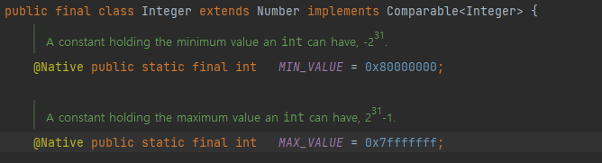

## 이펙티브 자바 - 22. 인터페이스는 타입을 정의하는 용도로만 사용하라

## 이펙티브 자바 - 22. 인터페이스는 타입을 정의하는 용도로만 사용하라

인터페이스는 자신을 구현한 클래스의 인스턴스를 참조할 수 있는 타입 역할을 한다. 인터페이스는 오직 이 용도로만 사용해야 한다.

이 지침에 맞지 않는 예로 소위 상수 인터페이스라는 것이 있다. 아래의 상수 인터페이스는 메서드 없이 상수를 뜻하는 static final 필드로만 가득찬 인터페이스로 인터페이스를 잘못 사용한 예이다.

~~~java
public interface PhysicalConstants {
    
    // 아보가드로 수 (1/몰)
    static final double AVOGADROS_NUMBER = 6.022_140_857e23;
    
    // 볼츠만 상수 (J/K)
    static final double BOLZMANN_CONSTANT = 1.380_648_52e-23;
    
    // 전자 질량 (Kg)
    static final double ELECTRON_MASS = 9.109_383_56e-31;

}
~~~

클래스 내부에 사용하는 상수는 외부 인터페이스가 아니라 내부 구현이므로, 내부 구현을 클래스 API로 노출하는 행위다. 

### 특정 클래스나 인터페이스와 강하게 연관된 상수라면 그 클래스나 인터페이스 자체에 추가해야한다.

특정 클래스나 인터페이스와 강하게 연관된 상수라면 그 클래스나 인터페이스 자체에 추가해야 한다. 모든 숫자 기본 타입의 박싱 클래스가 대표적으로, Integer와 Double에 선언된 MIN_VALUE와 MAX_VALUE 상수가 예다.

열거 타입으로 나타내기 적합한 상수라면 열거타입으로 만들어 공개하면 된다.

~~~ java
public enum Day{ MON, TUE, WED, THU, FRI, SAT, SUN};
~~~

그것도 아니라면 인스턴스화 할 수 없는 유틸리티 클래스에 담아 공개하자.
~~~java
public class PhysicalConstantsUtilityClass {
    // 인스턴스화 방지를 위한 private 생성자
    private PhysicalConstantsUtilityClass() {}; 
    
    // 아보가드로 수 (1/몰)
    public final double AVOGADROS_NUMBER = 6.022_140_857e23; // 자바 7부터는 숫자 리터럴에 _을 넣어 가독성을 높여준다. _를 사용하여 세자리씩 묶어주자 9,000,000 과 같은 개념

    // 볼츠만 상수 (J/K)
    public final double BOLZMANN_CONSTANT = 1.380_648_52e-23;

    // 전자 질량 (Kg)
    public final double ELECTRON_MASS = 9.109_383_56e-31; 
}
~~~
### 정리

인터페이스는 타입을 정의하는 용도로만 사용해야하며, 상수 공개용 수단으로 사용하면 안된다

