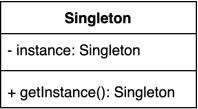

## 코딩으로 학습하는 GoF의 디자인 패턴 - 싱글톤 패턴

### 싱글톤 패턴 : 인스턴스를 오직 한개만 제공하는 클래스



시스템 런타임, 환경 세팅에 대한 정보 등, 인스턴스가 여러개 일 때 문제가 생길 수 있는 경우가 있다. 또한 객체가 리소스를 많이 차지하는 역할을 하는 무거운 클래스일 때 인스턴스를 오직 한개만 만들어 제공하는 클래스가 필요하다.

대표적으로 데이터베이스 연결 모듈을 예로 들 수 있는데, 데이터베이스에 접속하는 작업(I/O 바운드)은 그 자체로 무거운 작업에 속하며 또한 한번만 객체를 생성하고 돌려쓰면 되지 굳이 여러번 생성할 필요가 없기 때문이다.

이 밖에도 디스크 연결, 네트워크 통신, DBCP 커넥션풀, 스레드풀, 캐시, 로그 기록 객체 등에 이용된다.

#### 싱글톤 패턴 구현 방밥

1. private 생성자에 static 메소드 사용

```java

/**
 * private 생성자와 public static 메소드를 사용
 */
public class Settings {

    private static Settings instance;

    private Settings1() { }

    public static Settings getInstance() {
        if (instance == null) {
            instance = new Settings1();
        }

        return instance;
    }

}
```

- New로 생성자를 쓰지 못하게 Private 생성자를 만들고 글로벌 액세스가 가능하게 스태틱을 제공
- 멀티쓰레드 환경에서 안전하지 않음
  - 서로 다른 쓰레드가 동시에 `new Settings()` 실행하는 경우 싱글톤이 깨짐

2. 동기화(synchronized)를 사용해 멀티쓰레드 환경에 안전하게 구현

```java
/**
 * synchronized 사용해서 동기화
 */
public class Settings {

    private static Settings instance;

    private Settings2() { }

    public static synchronized Settings getInstance() {
        if (instance == null) {
            instance = new Settings();
        }

        return instance;
    }

}
```

- `getInstance()`메서드에 한 번에 하나의 쓰레드만 들어올 수 있게 **synchronized** 키워드 사용
- 함수를 호출할때마다 락을 걸기 때문에 성능 부하가 생길 수 있음

3. 이른 초기화 (eager initialization)을 사용하여 구현

```java
/**
 * eager initialization
 */
public class Settings {

    private static final Settings INSTANCE = new Settings();

    private Settings() { }

    public static Settings getInstance() {
        return INSTANCE;
    }

}
```

- 객체를 만드는 비용이 비싸지 않다면 이른 초기화로 미리 객체를 생성해 성능 부하를 방지할 수 있음

- 당장 객체를 사용하지 않더라도 메모리에 적재하기 때문에 만일 리소스가 큰 객체일 경우, 공간  자원 낭비가 발생

- 예외 처리를 할 수 없음

4. double checked locking으로 효율적인 동기화 블럭 구현

```java
/**
 * double checked locking
 */
public class Settings {

    private static volatile Settings instance;

    private Settings() { }

    public static Settings getInstance() {
        if (instance == null) {
            synchronized (Settings.class) {
                if (instance == null) {
                    instance = new Settings();
                }
            }
        }

        return instance;
    }

}
```

- Synchronized 비용이 신경쓰이지만 인스턴스를 사용이 될 때 만들고 싶은 경우 double checked locking을 사용해 구현

- java 1.5 이상에서 동작

> volatile 키워드를 통해 이 변수는 캐시에서 읽지 말고 메인 메모리에서 읽어오도록 지정

5. static inner 클래스를 사용해 구현

```java

/**
 * static inner 클래스 홀더
 */
public class Settings {

    private Settings() { }

    private static class SettingsHolder {
        private static final Settings INSTANCE = new Settings();
    }

    public static Settings getInstance() {
        return SettingsHolder.INSTANCE;
    }

}
```

- 자바 1.5 이하에서도 동작, 권장되는 방법 중 하나

- `static final`을 사용하지만 `getInstance()`가 호출될 때 로딩되기 때문에 지연 초기화(lazy initialization)를 충족하고 멀티쓰레드 환경에서도 안전

6. enum을 사용해 구현

```java
/**
 * Enum 사용
 */
public enum Settings5 {

    INSTANCE;

}

```

- 리플렉션으로 인스턴스를 만들 수 없도록 제한, 권장하는 방법 중 하나
- 이른 초기화와 같이 미리 만들어지고 상속을 할 수 없음
- enum은 기본적으로 serializable를 구현하고 있으며 별다른 장치를 추가하지 않아도 안전하게 동일한 인스턴스로 역질혈화가 됨

### 싱글톤 (Singleton) 패턴 구현 깨트리는 방법

위와 같이 구현했지만 사용할 때 싱들톤을 깨뜨릴 수 있는 방법들이 존재한다.

1. 리플렉션

```java
public static void main(String[] args) throws IOException, ClassNotFoundException {
   Settings settings1 = Settings.getInstance();
   Constructor<Settings> declaredConstructor = Settings.class.getDeclaredConstructor();
   declaredConstructor.setAccessible(true);
   Settings settings2 = declaredConstructor.newInstance();
   System.out.println(settings1 == settings2);
```

- 리플렉션에서 `setAccessible(true)`를 사용해 private 생성자에 접근하면 싱글톤을 깨뜨릴 수 있음

2. 직렬화 & 역직렬화

```java
public class App {
    public static void main(String[] args) throws IOException, ClassNotFoundException {
        Settings settings1 = Settings.INSTANCE;

        Settings settings2 = null;
        try (ObjectOutput out = new ObjectOutputStream(new FileOutputStream("settings.obj"))) {
            out.writeObject(settings1);
        }

        try (ObjectInput in = new ObjectInputStream(new FileInputStream("settings.obj"))) {
            settings2 = (Settings) in.readObject();
        }

        System.out.println(settings1 == settings2);
    }
}

```

- 역직렬화를 하는 경우 반드시 생성자를 사용해서 다시 한 번 인스턴스를 만들어주기 때문에 싱글톤이 깨짐

### 문제점

1. 모듈간 의존성이 높아진다.

인터페이스가 아닌 객체를 미리 생성하고 정적 메소드를 이용해 사용하기 때문에 클래스 사이에 강한 의존성과 높은 결합이 생길 수 있다.

2. SOLID 원칙에 위배되는 사례가 많다.

하나만 생성하기 때문에 여러가지 책임을 지니게 되는 경우가 많아 단일 책임 원칙(SRP)를 위반할 수 있다.

혼자 너무 많은 일을 하거나, 많은 데이터를 공유시키면 다른 클래스들 간의 결합도가 높아지게 되어 개방-폐쇄 원칙(OCP)에 위배될 수 있다.

의존 관계상 클ㄹ라이언트가 인터페이스와 같은 추상화가 아닌, 구체 클래스에 의존하게 되어 의존 역전 원칙(DIP)도 위반할 수 있다.

3. TDD 단위 테스트에 에로사항이 있다.

결과적으로 이러한 문제들을 안고있는 싱글톤 패턴은 유연성이 많이 떨어지는 패턴이라고 할 수 있다.

그래서 직접 유저가 만들어 사용하는 것 보다는, 스프링 컨테이너 같은 프레임워크의 도움을 받으면 싱글톤 패턴의 문제점들을 보완하면서 장점의 혜택을 누릴 수 있다.

스프링 프레임워크에서는 싱글톤 패턴이란게 없고 내부적으로 클래스의 제어를 Ioc(Inversion Of Control) 방식의 컨테이너에게 넘겨 컨테이너가 관리하기 때문에, 이를 통해 평범한 객체도 하나의 인스턴스 뿐인 싱글턴으로 존재가 가능하기 때문에 싱글톤 단점이 없다.

### 실무에서는 어떻게 쓰이나?

- 스프링에서 빈의 스코프 중에 하나로 싱글톤 스코프
- 자바의 java.lang.Runtime
- 다른 디자인 패턴(빌더, 퍼사드, 추상 팩토리 등) 구현체의 일부
