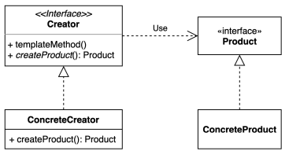

## 코딩으로 학습하는 GoF의 디자인 패턴 - 팩토리 메소드 패턴

### 팩토리 메소드 패턴



팩토리 메소드 패턴 : 구체적으로 어떤 인스턴스를 만들지는 서브 클래스가 정한다.

다양한 구현체(Product)가 있고, 그중에서 특정한 구현체를 만들 수 있는 다양한 팩토리(Creator)를 제공할 수 있다.

- Creator : 최상위 공장 클래스로서, 팩토리 메서드를 추상화하여 서브 클래스로 하여금 구현하도로 함
  - 객체 생성 처리 메서드(someOperartion) : 객체 생성에 관한 전처리, 후처리를 템플릿화한 메소드
  - 팩토리 메서드(createProduct) : 서브 공장 클래스에서 재정의할 객체 생성 추상 메서드
- ConcreteCreator : 각 서브 공장 클래스들은 이에 맞는 제품 객체를 반환하도록 생성 추상 메소드를 재정의한다. 즉, 제품 객체 하나당 그에 걸맞는 생산 공장 객체가 위치
- Product : 제품 구현체를 추상화
- ConcreteProduct : 제품 구현체

### 팩토리 메소드 (Factory method) 패턴 구현 예시

확장에 열려있고 변경에 닫혀있는 구조로 만들어보자. 크게 제품 계층과 크리에이터 계층으로 나뉘어 있다.

#### 제품 계층

#### Ship

```java
public class Ship {

    private String name;

    private String color;

    private String logo;

    private Wheel wheel;

    private Anchor anchor;

    // ~~~

}
```

#### BlackShip

```java
public class Blackship extends Ship {

    public Blackship() {
        setName("blackship");
        setColor("black");
        setLogo("⚓");
    }
}
```

#### Whiteship

```java
public class Whiteship extends Ship {

    public Whiteship() {
        setName("whiteship");
        setLogo("\uD83D\uDEE5️");
        setColor("white");
    }
}
```

##### 크리에이터(팩토리) 계층

#### ShipFactory

```java
public interface ShipFactory {

    default Ship orderShip(String name, String email) {
        validate(name, email);
        prepareFor(name);
        Ship ship = createShip();
        sendEmailTo(email, ship);
        return ship;
    }

    void sendEmailTo(String email, Ship ship);

    Ship createShip();

    private void validate(String name, String email) {
        if (name == null || name.isBlank()) {
            throw new IllegalArgumentException("배 이름을 지어주세요.");
        }
        if (email == null || email.isBlank()) {
            throw new IllegalArgumentException("연락처를 남겨주세요.");
        }
    }

    private void prepareFor(String name) {
        System.out.println(name + " 만들 준비 중");
    }

}
```

#### DefaultShipFactory

```java
public abstract class DefaultShipFactory implements ShipFactory {

    @Override
    public void sendEmailTo(String email, Ship ship) {
        System.out.println(ship.getName() + " 다 만들었습니다.");
    }

}
```

#### BlackshipFactory

```java
public class BlackshipFactory extends DefaultShipFactory {
    @Override
    public Ship createShip() {
        return new Blackship();
    }
}
```

#### WhiteshipFactory

```java
public class WhiteshipFactory extends DefaultShipFactory {
    @Override
    public Ship createShip() {
        return new Whiteship();
    }
}
```

### 팩토리 메소드 패턴 사용 시기

- 클래스 생성과 사용의 처리 로직을 분리하여 결합도를 낮추고자 할 때
- 코드가 동작해야 하는 객체의 유형과 종속성을 캡슐화를 통해 정보 은닉 처리 할 경우
- 라이브러리 혹은 프레임워크 사용자에게 구성 요소를 확장하는 방법을 제공하려는 경우
- 기존 객체를 재구성하는 대신 기존 객체를 재사용하여 리소스를 절약하고자 하는 경우
  - 상황에 따라 적절한 객체를 생성하는 코드는 자주 중복될 수 있다. 그리고 객체 생성 방식의 변화는 해당되는 모든 코드 부분을 변경해야 하는 문제가 발생한다.
  - 따라서 객체의 생성 코드를 별도의 클래스 / 메서드로 분리 함으로써 객체 생성의 변화에 대해 대비를 하기 위해 팩토리 메서드 패턴을 이용한다고 보면 된다.
  - 특정 기능의 구현은 별개의 클래스로 제공되는 것이 바람직한 설계이기 때

### 장단점

#### 장점

어떤 인스턴스를 만드는 그런 과정이 담겨있는 기존 로직을 건드리지 않고 그와 같은 류의 새로운 인스턴스르 다른방법으로 얼마든지 확장이 가능하다는게 장점이 되고, 이렇게 가능하지게 된 이유는 그 프로덕트와 크리에이터 간의 커플링을 루즐리하게 가져갔기 떄문이다.

크리에이터와 그 인스턴스에 해당하는 프로덕트 간의 관계를 느슨하게 가져갔기 때문에 확장에 열려있고 변경에 닫혀있는 OCP 원칙을 따를 수 있게 된다.

#### 단점

각자의 역할을 나누다 보니 팩토리 크리에어터와 제품의 계층 구조를 구현하기 위해 클래스가 늘어난다는 단점이 있다.

### 자바 8에 추가된 default 메소드

인터페이스에는 항상 추상 메소드만 정의를 할 수가 있었고 그 인터페이스를 구현하는 클래스에서 그 메소드를 구현하거나 아니면 그 인터페이스를 구현하는 클래스가 추상 클래스로 만들어지거나 그러한 방법밖에 없었다.

하지만 Java 8부터는 인터페이스에 기본 구현체를 만들수가 있어서 그 인터페이스를 구현하는 클래스 또는 그 인터페이스를 상속받은 또 다른 인터페이스 해당하는 기능을 사용할 수 있겠금 되었다 그래서 Java8부터는 추상클래스를 그렇게 많이 쓰지는 않는다.

### 실무에서 쓰이는 팩토리 메서드 예시

#### 스프링 BeanFactory

```java
// 컴포넌트 스캔, bean 설정 어노테이션, xml 파일 등의 bean 들을 매개변수로 주어 ConcreateProduct 를 반환
BeanFactory xmlFactory = new ClassPathXmlApplicationContext("config.xml");
String hello = xmlFactory.getBean("hello", String.class);

BeanFactory javaFactory = new AnnotationConfigApplicationContext(Config.class);
String hi = javaFactory.getBean("hi", String.class);
```

- Object 타입의 Product 를 만드는 BeanFactory 라는 Creator(최상위 공장 인터페이스)역할
- BeanFactory 가 Creator 인터페이스이고 이를 구현한 ClassPathXmlApplicationContext, AnnotationConfigApplicationContext 가 ConcreteCreator(공장 구현체) 역할
- 여기서 넘겨주는 Product 는 Object 타입이고 이를 넘겨 받는 인스턴스가 ConcreateProduct(제품) 가 된다.
- 컴포넌트 스캔, bean 설정 어노테이션, xml 파일 등의  bean 들이 결국 ConcreateProduct 에 해당되는 것
- ioc 컨테이너에 해당되는 클래스가 bean 팩토리 인데 이부분에 녹아져 있는 패턴이 팩토리 메서드 패턴
