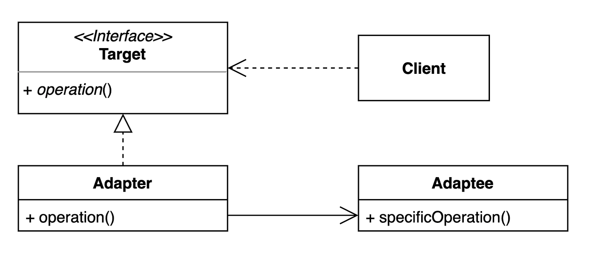
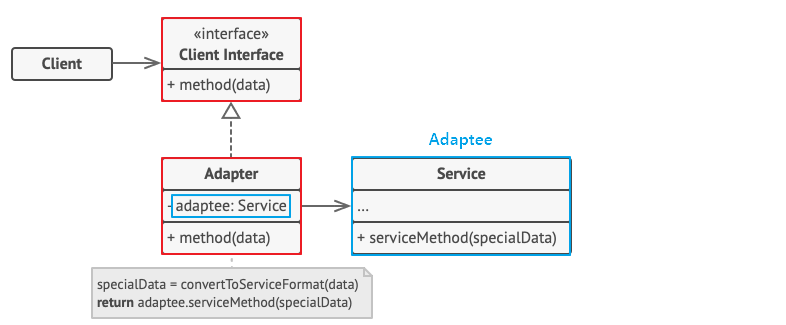
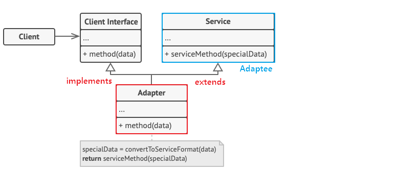

## GOF 디자인패턴 - 어댑터 패턴

## GOF 디자인패턴 - 어댑터 패턴

### 어댑터 패턴(Adaptor Pattern)

어댑터 패턴(Adaptor Pattern) 이란 이름 그대로 클래스를 어댑터로서 사용되는 구조 패턴이다.
어댑터는 우리 주변에도 많이 볼 수 있는 것으로서, 대표적으로 110V 전용 가전제품에 220V 어댑터를 끼워 사용하는 걸 들 수 있다. 즉, 서로 호환이 되지 않은 단자를 어댑터로 호환시켜 작동시키게끔 하는 것이 어댑터의 역할인 것이다.

기존 코드를 클라이언트가 사용하는 인터페이스의 구현체로 바꿔주는 행동패턴이다. 클라이언트가 사용하는 인터페이스를 따르지 않는 기존 코드를 재사용할 수 있게 해준다.

### 패턴 구조

Adapter 패턴에는 기존 시스템의 클래스를 상속(Inheritance) 해서 호환 작업을 해주냐, 합성(Composition)Visit Website 해서 호환 작업을 해주냐에 따라, 두 가지 패턴 방법으로 나뉜다.

1. 객체 어댑터

- 합성(Composition)된 맴버에게 위임을 이용한 어댑터 패턴 
- 자기가 해야 할 일을 클래스 맴버 객체의 메소드에게 다시 시킴으로써 목적을 달성하는 것을 위임이라고 함
- 합성을 활용했기 때문에 런타임 중에 Adaptee(Service)가 결정되어 유연
- Adaptee(Service) 객체를 필드 변수로 저장해야 되기 때문에 공간 차지 비용 발생

- Adaptee(Service) : 어댑터 대상 객체. 기존 시스템 / 외부 시스템 / 써드파티 라이브러리
- Target(Client Interface) : Adapter 가 구현하는 인터페이스
- Adapter : Client 와 Adaptee(Service) 중간에서 호환성이 없는 둘을 연결시켜주는 역할을 담당
  - Object Adaptor 방식에선 합성을 이용해 구성
  - Adaptee(Service)를 따로 클래스 멤버로 설정하고 위임을 통해 동작 매치
- Client : 기존 시스템을 어댑터를 통해 이용하려는 쪽. Client Interface를 통하여 Service 이용 가능

2. 클래스 어댑터

- 클래스 상속을 이용한 어댑터 패턴
- Adaptee(Service)를 상속했기 때문에 따로 객체 구현없이 바로 코드 재사용이 가능
- 자바에서는 다중 상속 불가 문제 때문에 전반적으로 권장하지는 않는 방법

- Adaptee(Service) : 어댑터 대상 객체. 기존 시스템 / 외부 시스템 / 써드파티 라이브러리
- Target(Cient Interface) : Adapter 가 구현하는 인터페이스
- Adapter : Client 와 Adaptee(Service) 중간에서 호환성이 없는 둘을 연결시켜주는 역할을 담당
  - Class Adaptor 방식에선 상속을 이용해 구성
  - Existing Class와 Adaptee(Service) 를 동시에 implements, extends 하여 구현
- Client : 기존 시스템을 어댑터를 통해 이용하려는 쪽. Client Interface를 통하여 Service 이용 가능

### 패턴 장점

- 프로그램의 기본 비즈니스 로직에서 인터페이스 또는 데이터 변환 코드를 분리할 수 있기 때문에 단일 책임 원칙(SRP)Visit Website을 만족한다.
- 기존 클래스 코드를 건들지 않고 클라이언트 인터페이스를 통해 어댑터와 작동하기 때문에 개방 폐쇄 원칙(OCP)Visit Website을 만족한다.
- 만일 추가로 필요한 메소드가 있다면 어댑터에 빠르게 만들 수 있다. 만약 버그가 발생해도 기존의 클래스에는 버그가 없으므로 Adapter 역할의 클래스를 중점적으로 조사하면 되고, 프로그램 검사도 쉬워진다.

 
### 패턴 단점

- 새로운 인터페이스와 어댑터 클래스 세트를 도입해야 하기 때문에 코드의 복잡성이 증가한다. 때로는 직접 서비스(Adaptee) 클래스를 변경하는것이 간단할수 있는 경우가 있기 때문에 신중히 선택하여야 한다.

1. Java

- java.util.Arrays의 asList()
- java.util.Collections의 list()
- java.util.Collections의 enumeration()
- java.io.InputStreamReader(InputStream) (returns a Reader)
- java.io.OutputStreamWriter(OutputStream) (returns a Writer)
- javax.xml.bind.annotation.adapters.XmlAdapter 의 marshal() and unmarshal()

2. Spring
  
- HandlerAdapter: 우리가 작성하는 다양한 형태의 핸들러 코드를 스프링 MVC가 실행할 수 있는 형태로 변환해주는 어댑터용 인터페이스