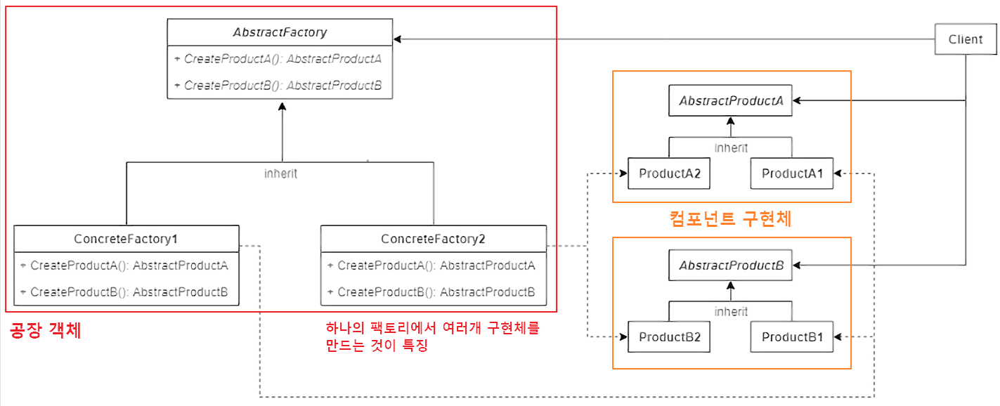

## 코딩으로 학습하는 GoF의 디자인 패턴 - 추상 팩토리 패턴

### 추상 팩토리 패턴

- AbstractFactory : 최상위 공장 클래스. 여러개의 제품들을 생성하는 여러 메소드들을 추상화 한다.
- ConcreteFactory : 서브 공장 클래스들은 타입에 맞는 제품 객체를 반환하도록 메소드들을 재정의한다.
- AbstractProduct : 각 타입의 제품들을 추상화한 인터페이스
- ConcreteProduct (ProductA ~ ProductB) : 각 타입의 제품 구현체들. 이들은 팩토리 객체로부터 생성된다.
- Client : Client는 추상화된 인터페이스만을 이용하여 제품을 받기 때문에, 구체적인 제품, 공장에 대해서는 모른다.
